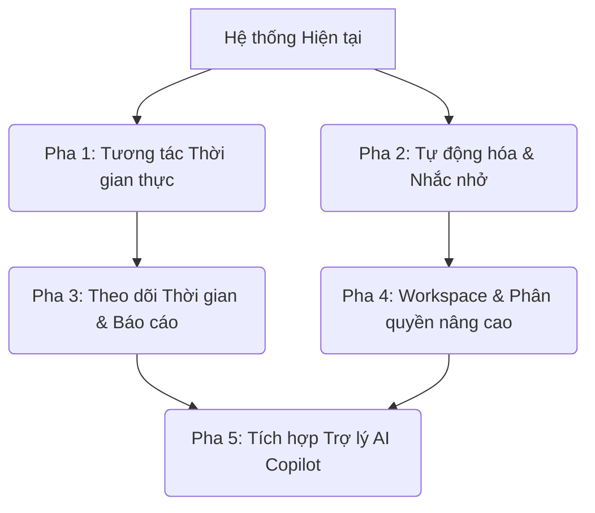

# 🚀 Taskflow - Tài liệu Đề xuất Nâng cấp Hệ thống (Proposed Features & Roadmap)

Tài liệu này mô tả chi tiết kiến trúc, giải pháp kỹ thuật và các bước thực hiện cho các tính năng nâng cấp được đề xuất nhằm chuyển đổi Taskflow thành một nền tảng quản lý công việc và cộng tác chuyên nghiệp.

---

## 🗺️ Lộ trình nâng cấp (Roadmap Overview)

---

## 🛠️ Chi tiết Kỹ thuật các Tính năng Đề xuất

### Phân hệ 1: Cộng tác Thời gian thực (Real-time Collaboration)
*Mục tiêu: Tăng tính tương tác tức thời giữa các thành viên đang hoạt động trên cùng một Board.*

#### 1. Trạng thái hoạt động (User Presence)
* **Ý tưởng**: Hiển thị danh sách avatar các thành viên đang online trên thanh tiêu đề của Board.
* **Cách triển khai Backend**:
  * Sử dụng sự kiện kết nối/ngắt kết nối WebSocket (`SessionConnectEvent` và `SessionDisconnectEvent`).
  * Lưu trạng thái Online/Offline vào Redis (hoặc một bộ nhớ đệm tạm thời) để tránh truy vấn MySQL liên tục.
* **Cách triển khai Frontend**:
  * Lắng nghe kênh WebSocket chung `/topic/board/{boardId}/presence`.
  * Cập nhật danh sách avatar động khi có sự kiện gia nhập/rời đi.

#### 2. Đồng bộ Live Kanban (HMR Live Kanban)
* **Ý tưởng**: Khi User A kéo thả Task, màn hình của User B cũng tự động di chuyển thẻ tương ứng mà không cần F5.
* **Cách triển khai**:
  * Khi API di chuyển Task (`PUT /api/boards/{boardId}/tasks/{taskId}/move`) thành công, Backend broadcast một tin nhắn qua WebSocket: `/topic/board/{boardId}/actions`.
  * Payload chứa: `type: "TASK_MOVED"`, `taskId`, `sourceColumnId`, `targetColumnId`, `targetIndex`.
  * Frontend nhận tin nhắn, cập nhật state của React Query cache (`queryClient.setQueryData`) để render lại vị trí thẻ.

---

### Phân hệ 2: Tự động hóa & Nhắc nhở (Automation & Reminders)
*Mục tiêu: Tự động hóa quy trình làm việc và giảm thiểu các thao tác thủ công.*

#### 1. Nhắc nhở Hạn chót Tự động (Deadline Scheduler)
* **Ý tưởng**: Gửi thông báo đến Assignee trước khi Task đến hạn chót (ví dụ trước 24 giờ).
* **Cách triển khai**:
  * Cài đặt **Spring Scheduler** (`@Scheduled`) hoặc tích hợp thư viện **Quartz Scheduler** trong Spring Boot.
  * Chạy một job ngầm định kỳ (ví dụ mỗi giờ một lần) quét các Task có `deadline` gần kề.
  * Tạo bản ghi `Notification` mới cho Assignee và gửi push qua WebSocket/Email.

#### 2. Bộ quy tắc tự động hóa (Trigger-Action Rules)
* **Ý tưởng**: Cho phép người dùng thiết lập quy tắc: *"Khi điều kiện X xảy ra -> Thực hiện hành động Y"*.
* **Cách triển khai**:
  * Thiết kế bảng cấu hình tự động hóa: `automation_rules (id, board_id, trigger_event, action_type, metadata)`.
  * Khi một sự kiện xảy ra ở Backend (ví dụ `ColumnChange`), hệ thống sẽ duyệt qua các quy tắc của Board, thực thi hành động tương ứng (như tự động thay đổi Assignee, đổi nhãn dán).

---

### Phân hệ 3: Theo dõi Thời gian & Năng suất (Time Tracking & Reports)
*Mục tiêu: Đo lường chính xác lượng thời gian bỏ ra cho mỗi Task và trực quan hóa năng suất dự án.*

#### 1. Đồng bộ đếm giờ (Task Work Log)
* **Ý tưởng**: Thêm nút **Start/Stop Timer** bên trong Task.
* **Cách triển khai**:
  * Tạo thực thể `WorkLog (id, task_id, user_id, start_time, end_time, duration_seconds)`.
  * API endpoints:
    * `POST /api/tasks/{taskId}/worklogs/start` — Lưu thời gian bắt đầu.
    * `POST /api/tasks/{taskId}/worklogs/stop` — Tính toán và lưu khoảng thời gian đã thực hiện.
  * Frontend hiển thị đồng hồ chạy thời gian thực (Live Timer) sử dụng React state `setInterval`.

#### 2. Biểu đồ tiến độ (Burndown & Velocity Charts)
* **Ý tưởng**: Trực quan hóa số lượng công việc còn lại so với thời gian dự kiến.
* **Cách triển khai**:
  * Backend chuẩn bị API tổng hợp số lượng Task hoàn thành theo từng ngày.
  * Frontend sử dụng thư viện **Recharts** vẽ biểu đồ có đường mục tiêu và đường thực tế để hiển thị tiến độ dự án.

---

### Phân hệ 4: Quản lý Không gian làm việc (Workspaces & RBAC)
*Mục tiêu: Hỗ trợ các tổ chức quản lý nhiều phòng ban và bảo mật tài nguyên tốt hơn.*

#### 1. Cấu trúc Không gian làm việc (Workspaces)
* **Ý tưởng**: Nhóm các Board liên quan vào chung một Workspace lớn.
* **Cách triển khai**:
  * Thiết kế thêm thực thể `Workspace (id, name, owner_id, description)`.
  * Thực thể `Board` sẽ có thêm liên kết khóa ngoại với `Workspace`.
  * Các API sẽ chuyển sang dạng `/api/workspaces/{workspaceId}/boards`.

#### 2. Phân quyền vai trò chi tiết (Granular RBAC)
* **Ý tưởng**: Định nghĩa bảng phân quyền chi tiết thay vì chỉ dùng enum cố định.
* **Cách triển khai**:
  * Sử dụng Spring Security để phân quyền dựa trên Annotation hoặc Interceptor.
  * Tạo bảng phân quyền thao tác: `role_permissions` lưu trữ cụ thể quyền của các chức vụ (Ví dụ: `ROLE_VIEWER` không được phép gọi POST/PUT/DELETE tới Task, Column).

---

### Phân hệ 5: Trợ lý AI Copilot (AI Integration)
*Mục tiêu: Ứng dụng trí tuệ nhân tạo để tăng tốc độ phân tách và theo dõi công việc.*

#### 1. Tự động chia nhỏ công việc (Auto Task Breakdown)
* **Ý tưởng**: AI tự động tạo các Subtask từ tiêu đề và mô tả của Task chính.
* **Cách triển khai**:
  * Tích hợp **Spring AI** hoặc gọi trực tiếp API của OpenAI/Gemini bằng HttpClient.
  * Gửi prompt: *"Phân tích công việc sau và trả về một mảng JSON chứa các đầu việc phụ cần làm: [Tiêu đề + Mô tả Task]"*.
  * Backend nhận kết quả, parse JSON và tự động chèn các bản ghi vào bảng `subtasks` của cơ sở dữ liệu.

#### 2. Tóm tắt tiến độ tuần (Sprint Summary)
* **Ý tưởng**: Tạo báo cáo tuần chỉ bằng một cú click.
* **Cách triển khai**:
  * Backend tổng hợp dữ liệu nhật ký hoạt động (`activity_logs`) của Board trong 7 ngày qua.
  * Gửi dữ liệu này sang AI kèm prompt yêu cầu tóm tắt hiệu suất làm việc, chỉ ra các Task bị tắc nghẽn và đưa ra gợi ý tối ưu.
  * Trả về báo cáo dạng Markdown hiển thị trực tiếp cho quản lý dự án.
